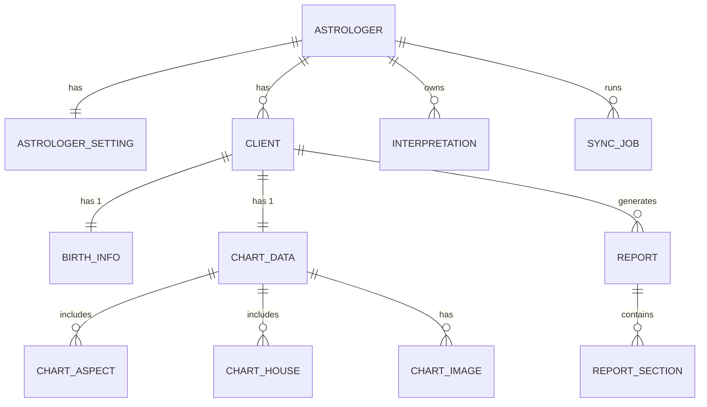

# 🗄️ Data Design — Horoscope PDF Generator (v1)

> **Scope** – reflects the latest decisions on settings normalization, ReportSection flexibility, authentication, and PII‑aware cloud sync.

---

## 1. Domain Model (Mermaid)

> *Preview*: paste into [https://mermaid.live/edit](https://mermaid.live/edit).

---

## 2. Table Definitions (all)

> SQL Server types; use VARCHAR/TEXT for SQLite.

### 2.1 `Astrologers`

| Column       | Type             | Constraints          | Notes                          |
| ------------ | ---------------- | -------------------- | ------------------------------ |
| Id           | UNIQUEIDENTIFIER | PK                   |                                |
| Name         | NVARCHAR(100)    | NOT NULL             |                                |
| Email        | NVARCHAR(320)    | NOT NULL UNIQUE      | **Login ID** (verified e‑mail) |
| PasswordHash | VARBINARY(64)    | NOT NULL             | PBKDF2‑HMAC‑SHA‑256            |
| PasswordSalt | VARBINARY(32)    | NOT NULL             |                                |
| CreatedAt    | DATETIME2        | DEFAULT GETUTCDATE() |                                |

### 2.2 `AstrologerSettings` (1‑to‑1)

| Column             | Type             | Constraints                     | Notes                            |
| ------------------ | ---------------- | ------------------------------- | -------------------------------- |
| AstrologerId       | UNIQUEIDENTIFIER | PK & FK → Astrologers(Id)       |                                  |
| HouseSystem        | NVARCHAR(20)     | NOT NULL                        | `Placidus`, `WholeSign`, …       |
| SectionOrderRule   | NVARCHAR(20)     | NOT NULL DEFAULT 'planetsFirst' | `planetsFirst` / `housesFirst`   |
| DeduplicateAspect  | BIT              | NOT NULL DEFAULT 0              | 1 = remove duplicate aspect text |
| DefaultBgImagePath | NVARCHAR(300)    | NULL                            | global report background         |
| UpdatedAt          | DATETIME2        | DEFAULT GETUTCDATE()            |                                  |

### 2.3 `Interpretations`

| Column       | Type             | Constraints           | Notes            |      |               |
| ------------ | ---------------- | --------------------- | ---------------- | ---- | ------------- |
| Id           | UNIQUEIDENTIFIER | PK                    |                  |      |               |
| AstrologerId | UNIQUEIDENTIFIER | FK → Astrologers(Id)  |                  |      |               |
| ConditionKey | NVARCHAR(100)    | INDEX IX\_Interp\_Key | e.g. \`Sun       | Moon | Conjunction\` |
| Body         | NTEXT            | NOT NULL              | Markdown allowed |      |               |
| UpdatedAt    | DATETIME2        | DEFAULT GETUTCDATE()  |                  |      |               |

### 2.4 `Clients`

| Column       | Type             | Constraints          | Notes                               |
| ------------ | ---------------- | -------------------- | ----------------------------------- |
| Id           | UNIQUEIDENTIFIER | PK                   |                                     |
| AstrologerId | UNIQUEIDENTIFIER | FK → Astrologers(Id) |                                     |
| Name         | NVARCHAR(100)    | NOT NULL             |                                     |
| Email        | NVARCHAR(320)    | NULL                 | **LocalOnly** (not pushed to cloud) |
| CreatedAt    | DATETIME2        | DEFAULT GETUTCDATE() |                                     |

### 2.5 `BirthInfos`

| Column    | Type             | Constraints           | Notes   |
| --------- | ---------------- | --------------------- | ------- |
| ClientId  | UNIQUEIDENTIFIER | PK & FK → Clients(Id) | 1:1     |
| BirthDate | DATE             | NOT NULL              |         |
| BirthTime | TIME             | NOT NULL              |         |
| Lat       | DECIMAL(9,4)     | NOT NULL              |         |
| Lon       | DECIMAL(9,4)     | NOT NULL              |         |
| TimeZone  | NVARCHAR(50)     | NOT NULL              | IANA tz |

### 2.6 `ChartData`

| Column          | Type             | Constraints           | Notes |
| --------------- | ---------------- | --------------------- | ----- |
| ClientId        | UNIQUEIDENTIFIER | PK & FK → Clients(Id) | 1:1   |
| PlanetPositions | NVARCHAR(MAX)    | NOT NULL              | JSON  |
| HouseCusps      | NVARCHAR(MAX)    | NOT NULL              | JSON  |
| CalculatedAt    | DATETIME2        | DEFAULT GETUTCDATE()  |       |

### 2.7 `ChartAspects`

| 列名          | 型                | 制約                       | 説明      |
| ----------- | ---------------- | ------------------------ | ------- |
| Id          | UNIQUEIDENTIFIER | PK                       |         |
| ChartDataId | UNIQUEIDENTIFIER | FK → ChartData(ClientId) |         |
| AspectType  | NVARCHAR(50)     | NOT NULL                 | アスペクト種別 |
| BodyA       | NVARCHAR(20)     | NOT NULL                 | 天体A     |
| BodyB       | NVARCHAR(20)     | NOT NULL                 | 天体B     |
| Orb         | DECIMAL(9,4)     | NOT NULL                 | オーブ     |

### 2.8 `ChartHouses`

| 列名          | 型                | 制約                       | 説明        |
| ----------- | ---------------- | ------------------------ | --------- |
| Id          | UNIQUEIDENTIFIER | PK                       |           |
| ChartDataId | UNIQUEIDENTIFIER | FK → ChartData(ClientId) |           |
| HouseNo     | INT              | NOT NULL                 | 1–12      |
| Body        | NVARCHAR(20)     | NOT NULL                 | 天体/アステロイド |

### 2.9 `ChartImages`

| 列名          | 型                | 制約                       | 説明         |
| ----------- | ---------------- | ------------------------ | ---------- |
| Id          | UNIQUEIDENTIFIER | PK                       |            |
| ChartDataId | UNIQUEIDENTIFIER | FK → ChartData(ClientId) |            |
| Name        | NVARCHAR(100)    | NOT NULL                 | 画像名        |
| FilePath    | NVARCHAR(300)    | NOT NULL                 | 相対パス       |
| BlobUrl     | NVARCHAR(500)    | NULL                     | バックアップ URL |
| WidthPx     | INT              |                          |            |
| HeightPx    | INT              |                          |            |
| Dpi         | INT              |                          |            |
| UploadedAt  | DATETIME2        | DEFAULT GETUTCDATE()     |            |

### 2.10 `Reports`

| 列名          | 型                | 制約                   | 説明                 |
| ----------- | ---------------- | -------------------- | ------------------ |
| Id          | UNIQUEIDENTIFIER | PK                   |                    |
| ClientId    | UNIQUEIDENTIFIER | FK → Clients(Id)     |                    |
| ReportType  | NVARCHAR(50)     | NOT NULL             | `Full`/`Summary` 等 |
| FilePath    | NVARCHAR(400)    | NOT NULL             | 生成 PDF 保存先         |
| GeneratedAt | DATETIME2        | DEFAULT GETUTCDATE() |                    |

### 2.11 `ReportSections` – flexible pages `ReportSections` – flexible pages

| Column              | Type             | Constraints        | Notes                                            |
| ------------------- | ---------------- | ------------------ | ------------------------------------------------ |
| Id                  | UNIQUEIDENTIFIER | PK                 |                                                  |
| ReportId            | UNIQUEIDENTIFIER | FK → Reports(Id)   |                                                  |
| SectionKind         | NVARCHAR(20)     | NOT NULL           | `Cover`,`Intro`,`Major`,`Minor`,`Chart`,`Footer` |
| Heading             | NVARCHAR(100)    | NULL               | Visible heading text                             |
| ShowHeading         | BIT              | NOT NULL DEFAULT 1 | 0 = hidden                                       |
| BackgroundImagePath | NVARCHAR(300)    | NULL               | optional BG                                      |
| Body                | NTEXT            | NOT NULL           | content                                          |
| Level               | INT              | NOT NULL           | 0=other,1=Major,2=Minor                          |
| SortOrder           | INT              | NOT NULL           | order                                            |

### 2.12 `SyncJobs`

\| Id PK · AstrologerId FK · JobType NVARCHAR(20) · Status NVARCHAR(20) · StartedAt · EndedAt · ErrorMsg |

---

## 3. Cloud Sync & PII Policy

| Table.Column      | Sync Policy                   | Rationale                      |
| ----------------- | ----------------------------- | ------------------------------ |
| Clients.Email     | **LocalOnly**                 | Avoid storing PII in Azure SQL |
| PasswordHash/Salt | Synced (encrypted connection) | required for auth              |
| BirthInfos.\*     | Synced (encrypted)            | essential for chart calc       |

`SyncJob` executor skips `LocalOnly` columns or masks them before upload.

---

## 4. Migration Plan

* **InitialCreate**: all tables above with indexes `(Interpretations ConditionKey)`, `(ReportId, SortOrder)`.
* Further changes via ADR → EF Core `Add‑Migration`.

---

## 5. Action Items (TODO)

* Implement PBKDF2 password hashing & secure storage.
* Generate `SortOrder` and apply `SectionKind` rules in PDF renderer.
* Add UI for managing `AstrologerSettings`.
* Define SyncJob retry & notification policy.
* Optional: automatic 300 DPI conversion of ChartImages before embed.
