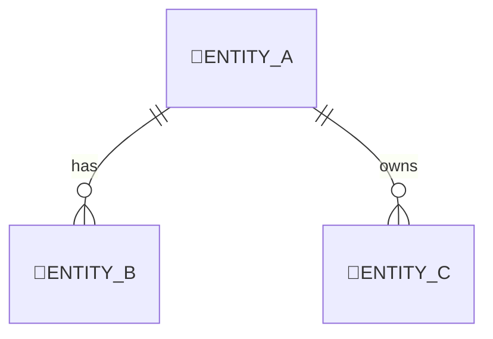
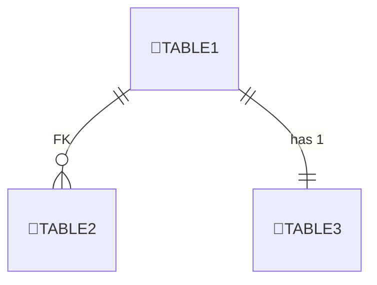

# 🗄️ Data Design — <プロジェクト名> (template)

> **このドキュメントはデータ設計のひな形です。** 🔲 を埋めながらスキーマを確定してください。

---

## 1. ドメインモデル（Mermaid）

> *Mermaid 例* — 実際のエンティティに置き換えてください。

---

## 1.1 ER 図（テーブルレベル）

---

## 2. テーブル定義

> **型メモ**: SQL Server 相当で記述。SQLite では TEXT などへ置換。

### 2.x `<TableName>`

| 列名       | 型                | 制約           | 説明            |
| -------- | ---------------- | ------------ | ------------- |
| Id       | UNIQUEIDENTIFIER | PK           | 🔲            |
| 🔲Column | 🔲Type           | 🔲Constraint | 🔲Description |

> *テーブルを追加するたびに「### 2.x」セクションを複製して下さい。*

---

## 3. Cloud Sync & PII Policy（例）

| テーブル.列          | 同期方針      | 理由             |
| --------------- | --------- | -------------- |
| 🔲Clients.Email | LocalOnly | PII をクラウド保存しない |

---

## 4. Migration Plan

* **InitialCreate**: 🔲作成するテーブルとインデックスを列挙。
* 以降の変更手順を ADR → `Add-Migration` で管理。

---

## 5. TODO

* [ ] 🔲テーブル定義の未記入欄を埋める
* [ ] 🔲ER 図を最新に更新
* [ ] 🔲インデックス設計を追加
