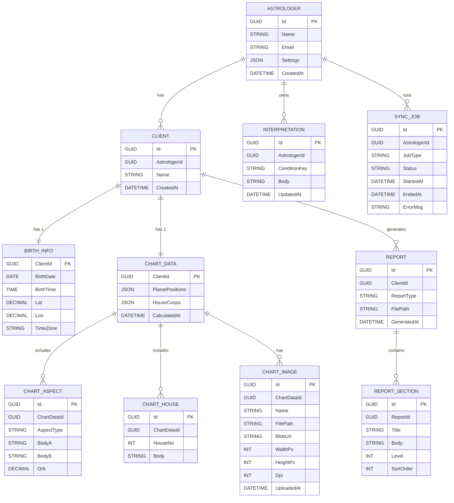

# 🗄️ Data Design — Horoscope PDF Generator (v1)

> **目的**: 要件定義に基づき、初版 (v1) のドメインモデルと RDB スキーマを提示する。

---

## 1. ドメインモデル（集約図）

```
[Astrologer]──<1..*>──[Client]──1──[BirthInfo]
                     │
                     ├──1──[ChartData]──<*>──[ChartAspect]
                     │                     └──[ChartHouse]
                     │                     └──<*>──[ChartImage]
                     │
                     ├──<*>──[Report]──<*>──[ReportSection]
                     │
                     └──<*>──[SyncJob]
```

* **ChartImage** — 1 チャートに複数画像可。`FilePath` (相対パス) と `BlobUrl` (バックアップ先 URL) を保持。
* **ReportSection** — Major=星座見出し / Minor=アスペクト or ハウス見出し。並び順・重複抑制ルールは `Astrologer.Settings` に保存。
* **SyncJob** — ローカルと Azure への同期処理をジョブ単位で管理。

---

## 2. ER 図（Mermaid）



---

## 3. テーブル定義（主要テーブル）

### 3.1 `ChartImages`

| 列           | 型             | 制約                   | 説明             |
| ----------- | ------------- | -------------------- | -------------- |
| Id          | GUID          | PK                   |                |
| ChartDataId | GUID          | FK → ChartData       |                |
| Name        | NVARCHAR(100) | NOT NULL             | 表示名            |
| FilePath    | NVARCHAR(300) | NOT NULL             | 画像の相対パス        |
| BlobUrl     | NVARCHAR(500) | NULL                 | Azure Blob URL |
| WidthPx     | INT           |                      |                |
| HeightPx    | INT           |                      |                |
| Dpi         | INT           |                      |                |
| UploadedAt  | DATETIME2     | DEFAULT GETUTCDATE() |                |

### 3.2 `ReportSections`

| 列         | 型             | 制約           | 説明              |
| --------- | ------------- | ------------ | --------------- |
| Id        | GUID          | PK           |                 |
| ReportId  | GUID          | FK → Reports |                 |
| Title     | NVARCHAR(100) |              |                 |
| Body      | NTEXT         | NOT NULL     |                 |
| Level     | INT           | NOT NULL     | 1=Major,2=Minor |
| SortOrder | INT           | NOT NULL     | レポート内順序         |

### 3.3 `SyncJobs`

| 列            | 型             | 制約               | 説明                                  |
| ------------ | ------------- | ---------------- | ----------------------------------- |
| Id           | GUID          | PK               |                                     |
| AstrologerId | GUID          | FK → Astrologers |                                     |
| JobType      | NVARCHAR(20)  | NOT NULL         | Upload / Download                   |
| Status       | NVARCHAR(20)  | NOT NULL         | Queue / InProgress / Success / Fail |
| StartedAt    | DATETIME2     | NOT NULL         |                                     |
| EndedAt      | DATETIME2     | NULL             |                                     |
| ErrorMsg     | NVARCHAR(MAX) | NULL             | 失敗時メッセージ                            |

---

## 4. マイグレーション指針

* **InitialCreate**: すべてのテーブルと基本インデックスを生成。
* 以降のスキーマ変更は ADR で決定し `Add-Migration` で適用。

---

## 5. TODO

1. **SortOrder 自動生成** — `Astrologer.Settings.sectionOrderRule` を実装（例: `planetsFirst`/`housesFirst`）。
2. **Aspect 重複抑制** — `deduplicateAspect` フラグ true の場合、BodyA が属する星座にのみ出力。
3. **SyncJob 再実行ポリシー** — リトライ間隔と回数を決定し ADR に記録。
4. **ChartImage 圧縮** — PDF 埋め込み前に 300 DPI へ統一する必要性を検証。
5. **ReportSection インデックス** — `(ReportId, SortOrder)` で読み取り性能を確認。
