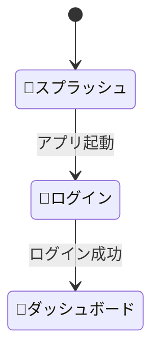

# 🎨 UI Design — <プロジェクト名>

> **ファイル位置例**: `docs/ui-design.md`
>
> 本ドキュメントは **画面遷移図・ワイヤーフレーム・MVVM マッピング** をまとめる “ひな形” です。🔲 を埋めながら実装に合わせて更新してください。

---

## 1. 画面一覧 & 画面 ID

| 画面ID  | 画面名 (英語キー)  | 主な役割             |
| ----- | ----------- | ---------------- |
| S00   | 🔲Splash    | 🔲起動処理・DBチェック など |
| S01   | 🔲Login     | 🔲ログイン画面         |
| S10   | 🔲Dashboard | 🔲メイン一覧画面        |
| 🔲SXX | 🔲NewScreen | 🔲役割             |

> **Tips**: 画面が増えたら行を追加し、ID は S11, S12 … のように連番で管理。

---

## 2. 画面遷移図（Mermaid）

> Mermaid のコードブロックを [https://mermaid.live/edit](https://mermaid.live/edit) に貼り付けると図を確認できます。

---

## 3. ワイヤーフレーム概要

> 詳細なモックアップは Figma や Excalidraw 等をリンクしてください。

### 🔲S10 Dashboard

* 🔲左ペイン: **ClientList** (DataGrid)
* 🔲右ペイン: **RecentReports** (ListView)

### 🔲S11 ClientForm

* 🔲入力項目: Name, Email, BirthDate …

---

## 4. MVVM マッピング

| 画面ID | View (.xaml)      | ViewModel (.cs)        | 依存するコマンド／クエリ            |
| ---- | ----------------- | ---------------------- | ----------------------- |
| S10  | 🔲`DashboardView` | 🔲`DashboardViewModel` | 🔲`ListClientsQuery` など |
| S11  | 🔲…               |                        |                         |

> コマンド / クエリは `application-design.md` の一覧と同期させてください。

---

## 5. スタイルガイド（例）

* **フォント**: 🔲例: Noto Sans JP / Inter
* **カラー**: 🔲ベース #1B2538、アクセント #FFAA00
* **テーマ**: 🔲ダークモード優先 / ライトは Backlog
* **共通スタイル定義** → `src/Presentation.Desktop/Styles/`

  * `Buttons.axaml`, `TextBoxes.axaml`, …

---

## 6. TODO

* [ ] 🔲Figma URL を追記
* [ ] 🔲未定義画面のワイヤーフレーム作成
* [ ] 🔲MVVM マッピング表を最新化

---

> **更新ルール**
>
> 1. 画面追加・遷移変更があれば本ドキュメントを即更新。
> 2. ViewModel 追加時はマッピング表を必ず追記。
> 3. Pull Request でレビュー & マージ。

