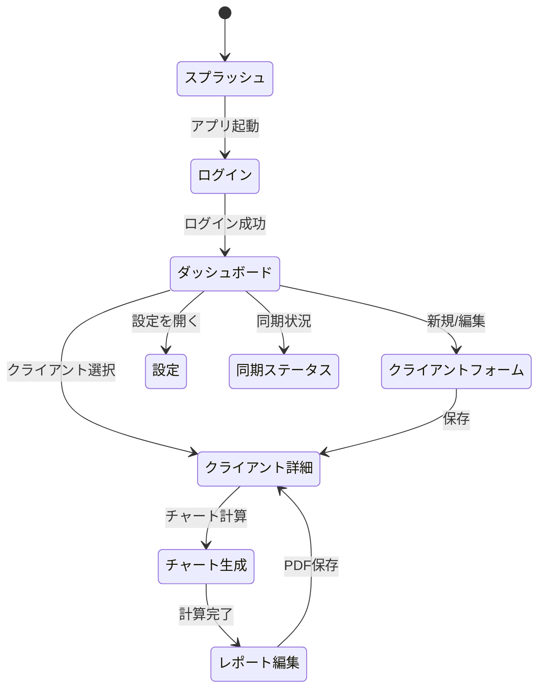

# 🎨 UI Design — Horoscope PDF Generator

> **ファイル位置**: `docs/ui-design.md`
>
> 本ドキュメントは **画面遷移図・ワイヤーフレーム・MVVM マッピング** を管理する *Living Document* です。実装が進むにつれて随時更新してください。

---

## 1. 画面一覧 & ID 付番

| 画面ID | 画面名 (英語キー)    | 主な役割                         |
| ---- | ------------- | ---------------------------- |
| S00  | Splash        | 起動ロゴ・DB 初期化チェック              |
| S01  | Login         | 占い師ログイン (Email + Password)   |
| S10  | Dashboard     | クライアント一覧 + 最近のレポート           |
| S11  | ClientForm    | クライアント作成 / 編集 (BirthInfo 含む) |
| S12  | ClientDetail  | チャートプレビュー + レポート履歴           |
| S20  | ChartGenerate | チャート計算進捗モーダル                 |
| S30  | ReportEditor  | セクション並び替え・背景設定 UI            |
| S40  | Settings      | AstrologerSettings 編集        |
| S99  | SyncJobStatus | 同期ジョブ進捗ダイアログ                 |

---

## 2. 画面遷移図（Mermaid）

*表示*: [https://mermaid.live/edit](https://mermaid.live/edit) に貼り付けて確認

---

## 3. ワイヤーフレーム概要

> 詳細なレイアウトは Figma 共有予定。ここでは主要コンポーネントを記述。

### S10 Dashboard

* 左: **ClientList** (DataGrid) — 新規 / 編集 ボタン
* 右: **RecentReports** (ListView)
* 上部: Sync ステータスアイコン + 設定ギア

### S11 ClientForm

* 入力: Name, Email (optional), BirthDate, BirthTime (ClockPicker), Place (Lat/Lon or Search)
* 検証エリア: 赤字 + ToolTip

※ 他画面は TBD — 実装時に追記

---

## 4. MVVM マッピング

| 画面ID | View (.xaml)          | ViewModel (.cs)          | 主なコマンド / クエリ依存                                                  |
| ---- | --------------------- | ------------------------ | --------------------------------------------------------------- |
| S10  | `DashboardView`       | `DashboardViewModel`     | `ListClientsQuery`, `ListReportsQuery`, `StartSyncJobCommand`   |
| S11  | `ClientFormView`      | `ClientFormViewModel`    | `CreateClientCommand`, `UpdateClientCommand`                    |
| S12  | `ClientDetailView`    | `ClientDetailViewModel`  | `GenerateChartCommand`, `CreateReportCommand`                   |
| S20  | `ChartGenerateView`   | `ChartGenerateViewModel` | `GenerateChartCommand`                                          |
| S30  | `ReportEditorView`    | `ReportEditorViewModel`  | `UpdateReportSectionCommand` *(予定)*                             |
| S40  | `SettingsView`        | `SettingsViewModel`      | `GetAstrologerSettingsQuery`, `UpdateAstrologerSettingsCommand` |
| S99  | `SyncJobStatusDialog` | `SyncJobStatusViewModel` | `GetSyncJobStatusQuery`                                         |

---

## 5. スタイルガイド

* **フォント**: Noto Sans JP / Inter
* **カラー**: ベース #1B2538、アクセント #FFAA00
* **ダークモード**のみ対応 (Light は backlog)
* **コンポーネント共通スタイル** → `src/Presentation.Desktop/Styles/`

  * `Buttons.axaml`, `TextBoxes.axaml`, `Dialogs.axaml`, `DataGrids.axaml`

---

## 6. TODO

* [ ] Figma URL を追加し各画面の詳細ワイヤーフレームをリンク
* [ ] SyncJobStatus (S99) のアイコン／進捗バー UI 詳細化
* [ ] チャート画像プレビューコンポーネントを CustomControl として設計
* [ ] ダーク / ライト切替対応を Backlog に登録

---

> **更新ルール**
>
> * 画面追加・遷移変更があれば **このドキュメントを最優先で更新**。
> * ViewModel 新規作成時は MVVM マッピング表に行を追加。
> * レビューは Pull Request ベースで行います。

